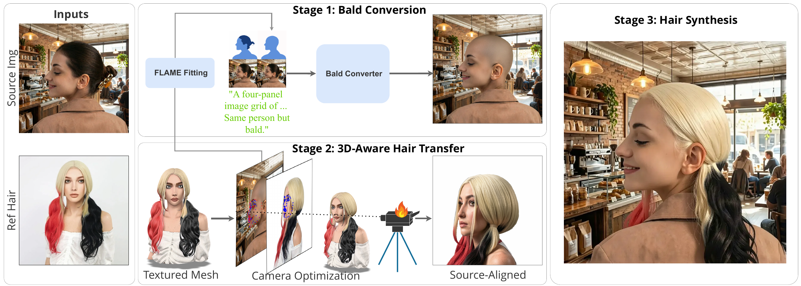
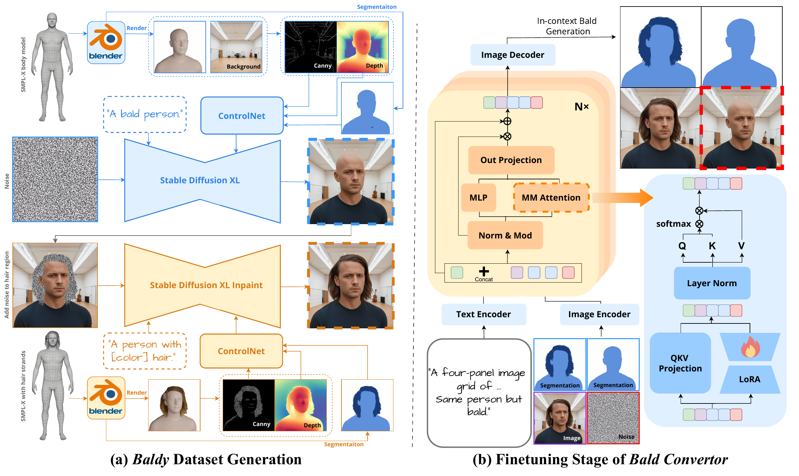

<h1 align="center">HairPort</h1>

<p align="center">
  <strong>In-context 3D-Aware Hair Import and Transfer for Images</strong>
  <br>
  <strong>ACM SIGGRAPH 2026</strong>
  <br>
  A. Heidari, A. Alimohammadi, W. Michel Pinto Lira, A. Bar-Lev, and A. Mahdavi-Amiri
</p>

<p align="center">
  
  <a href="LICENSE"></a>
  = 3.10" src="https://img.shields.io/badge/Python-%3E%3D3.10-3776ab">
  
  
</p>

<p align="center">
  
  <a href="https://deepmancer.github.io/HairPort/"></a>
  
  <a href="https://huggingface.co/deepmancer/bald_konverter"></a>
  <a href="https://huggingface.co/datasets/deepmancer/baldy"></a>
</p>

HairPort transfers a reference hairstyle onto a source face while explicitly handling large pose and scale differences through 3D-aware alignment before image synthesis.

---

## News

- **May 2026:** HairPort was accepted to **ACM SIGGRAPH 2026**.
- **May 2026:** Launched the [HairPort project page](https://deepmancer.github.io/HairPort/).
- **April 2026:** Initial HairPort source code released; packaging and dependency manifests will be finalized soon.
- **April 2026:** Released the [Baldy dataset](https://huggingface.co/datasets/deepmancer/baldy) for paired bald/original image training.
- **April 2026:** Released the [Bald Converter LoRA weights](https://huggingface.co/deepmancer/bald_konverter).

---

## Results Teaser

<p align="center">
  
  <br>
  <sub><b>Figure 1.</b> HairPort transfers hairstyles across challenging identity, pose, scale, and style differences.</sub>
</p>

---

## Method At A Glance

<p align="center">
  
  <br>
  <sub><b>Figure 2.</b> HairPort removes source hair, aligns the reference hairstyle in 3D, and synthesizes the final transfer from source-aligned hair evidence.</sub>
</p>

<p align="center">
  
  <br>
  <sub><b>Figure 3.</b> Baldy dataset generation and LoRA-based Bald Converter finetuning for in-context bald generation.</sub>
</p>

<details>
<summary><b>Paper Abstract</b></summary>

Transferring hairstyles between images is an important but challenging task in computer graphics, computer vision, and visual effects. It enables users to explore new looks without physically altering their hair, with applications in virtual try-on systems, augmented reality, and entertainment. Most prior works operate best under small pose gaps, and they fall short under large viewpoint and scale differences, where missing hair content must be synthesized rather than transferred.

We propose **HairPort**, a 3D-aware hairstyle transfer framework that addresses these issues by explicitly separating hair removal from transfer and enforcing geometric consistency before synthesis. We introduce a **Bald Converter**, which produces realistic bald versions of faces through LoRA-based in-context adaptation of FLUX. To train the Bald Converter, we introduce a new dataset, **Baldy**, containing 6,400 paired bald and original images across diverse identities and conditions. We also use a **3D-Aware Transfer Pipeline** that reconstructs and re-renders the reference hairstyle from the target viewpoint before compositing it onto the source image. Being 3D-aware, our method supports large pose and scale discrepancies between the source and target. With these components in place, we employ a conditional flow-matching generator to synthesize the final image conditioned on the bald source, the pose-aligned hair rendering, the original reference image, and a text prompt. Together, our method enables accurate, pose-consistent, and identity-preserving hairstyle transfer, outperforming existing methods both qualitatively and quantitatively.

</details>

---

## Repository Status

> **Official source preview.** This repository contains the official SIGGRAPH 2026 implementation snapshot, including the pipeline source, configuration, asset layout, README figures, Bald Converter links, and dataset links.
>
> Packaging is still being finalized: this snapshot does **not** include `pyproject.toml`, `setup.py`, `setup.cfg`, a pinned dependency manifest, or installed console-script entry points. For now, run commands from the repository root with `python -m ...` and set `PYTHONPATH` as shown below.

---

## Installation

### Requirements

- **Python** >= 3.10
- **CUDA-capable GPU** recommended; most stages are GPU-heavy and >=24 GB VRAM is recommended
- **Blender** >= 4.0 for multi-view rendering in 3D landmark and rendering stages
- **Hugging Face access** for auto-downloaded model weights

### 1. Create an environment

```bash
conda create -n hairport python=3.11 -y
conda activate hairport
```

### 2. Install PyTorch

Install the PyTorch build matching your CUDA version. Example for CUDA 12.4:

```bash
pip install torch torchvision --index-url https://download.pytorch.org/whl/cu124
```

### 3. Get HairPort

```bash
git clone https://github.com/deepmancer/HairPort.git
cd HairPort
export PYTHONPATH="$PWD:${PYTHONPATH}"
```

### 4. Install remaining dependencies

The current full dependency recipe is documented in [`scripts/install.sh`](scripts/install.sh). It is a full bootstrap/reference script rather than a minimal in-place package installer, so review it before running or adapting it. It includes system-level tools, source builds, CUDA-specific packages, and optional project utilities.

```bash
# From the parent directory that contains HairPort:
cd ..
bash HairPort/scripts/install.sh
cd HairPort
```

### 5. Set up external modules

This clones CodeFormer, MV-Adapter, and SHeaP into `modules/`:

```bash
bash scripts/setup_submodules.sh
```

Hi3DGen is not bundled. Generate textured 3D head meshes externally and place them in the expected data layout before running the full transfer pipeline.

### 6. Add FLAME assets

1. Register and download **FLAME 2020** from [flame.is.tue.mpg.de](https://flame.is.tue.mpg.de).
2. Place the required files at:

```text
assets/flame/FLAME2020/
├── generic_model.pt
├── eyelids.pt
└── FLAME_masks.pkl
```

3. Place the MediaPipe-FLAME landmark mapping at:

```text
assets/body_models/landmarks/flame/mediapipe_landmark_embedding.npz
```

### 7. Log in to Hugging Face

Most model weights are downloaded automatically on first use.

```bash
huggingface-cli login
```

---

## Quick Start

This example transfers the **reference hairstyle** from `reference.png` onto the **source face** in `source.png`.

### 1. Prepare inputs

```bash
mkdir -p my_project/image
mkdir -p my_project/matted_image

cp source.png    my_project/image/source.png
cp reference.png my_project/image/reference.png
```

The filename stem becomes the identity ID used throughout the pipeline.

### 2. Add 3D head meshes

HairPort requires a textured 3D head mesh for each identity. Generate these externally using a reconstruction tool such as Hi3DGen, Hunyuan3D, or your own pipeline.

```bash
mkdir -p my_project/mvadapter/hi3dgen/source
mkdir -p my_project/mvadapter/hi3dgen/reference

# Required files:
# my_project/mvadapter/hi3dgen/source/shape_mesh.glb
# my_project/mvadapter/hi3dgen/reference/shape_mesh.glb
```

Stage 3 simplifies and frontalizes meshes, but it does not generate them.

### 3. Create transfer pairs

Create `my_project/pairs.csv`:

```csv
target_id,source_id,lift_3d,head_diff_angle
reference,source,True,0.98
```

`target_id` is the identity providing the **reference hairstyle**. `source_id` is the identity providing the **source face**. The `lift_3d` and `head_diff_angle` columns are optional; if omitted, they are computed automatically.

### 4. Run HairPort

```bash
python -m hairport.pipeline \
  --data_dir my_project \
  --shape_provider hi3dgen \
  --texture_provider mvadapter \
  --bald_version w_seg
```

### 5. Find the output

```text
my_project/view_aligned/shape_hi3dgen__texture_mvadapter/reference_to_source/w_seg/3d_aware/transferred_klein/hair_restored.png
```

Depending on GPU memory and model cache state, the full pipeline can take several minutes per transfer pair.

### Python API

```python
from hairport.pipeline import HairPortPipeline

pipeline = HairPortPipeline(
    data_dir="my_project",
    shape_provider="hi3dgen",
    texture_provider="mvadapter",
    bald_version="w_seg",
)

results = pipeline.run()
for r in results:
    status = "OK" if r.success else "FAIL"
    print(f"[{status}] {r.stage:20s} {r.duration_seconds:.1f}s")
```

---

## Pipeline Stages

| # | Stage | What happens |
|---|-------|--------------|
| 1 | **Baldify** | Generate a realistic bald source portrait using the Bald Converter. |
| 2 | **Caption** | Outpaint bald images and generate text descriptions with Qwen Image-Edit. |
| 3 | **Shape Mesh** | Simplify and frontalize externally generated 3D head meshes. |
| 4 | **Landmark 3D** | Estimate 3D facial landmarks with Blender renders and MediaPipe fusion. |
| 5 | **Align View** | Optimize camera alignment from reference hairstyle to source face. |
| 6 | **Render View** | Generate textured target-hair views with MV-Adapter and SDXL. |
| 7 | **Enhance View** | Refine rendered views with FLUX.2 Klein 9B and CodeFormer. |
| 8 | **Blend Hair** | Warp and Poisson-blend enhanced hair onto the bald source. |
| 9 | **Transfer Hair** | Synthesize the final 3D-aware hairstyle transfer. |

Run a subset of stages when debugging:

```bash
# Resume from a stage
python -m hairport.pipeline --data_dir my_project --start render_view

# Run only selected stages
python -m hairport.pipeline --data_dir my_project --only blend_hair transfer_hair

# Skip selected stages
python -m hairport.pipeline --data_dir my_project --skip shape_mesh landmark_3d
```

---

## Data Layout

HairPort expects inputs and writes intermediates under `data_dir`:

```text
data_dir/
├── image/                          # Input portraits
│   ├── source.png
│   └── reference.png
├── matted_image/                   # Background-removed images
├── pairs.csv                       # Transfer pairs
│
├── mvadapter/hi3dgen/              # User-provided 3D head meshes
│   ├── source/shape_mesh.glb
│   └── reference/shape_mesh.glb
│
├── bald/
│   └── w_seg/
│       ├── image/                  # Bald portraits
│       └── image_outpainted/       # Outpainted bald images
├── lmk_3d/
│   └── shape_hi3dgen__texture_mvadapter/
│       └── <identity>/landmarks_3d.npy
│
└── view_aligned/
    └── shape_hi3dgen__texture_mvadapter/
        └── <target>_to_<source>/
            ├── alignment/          # Rendered and enhanced views
            └── <bald_version>/
                └── 3d_aware/
                    ├── warping/
                    ├── blending/
                    └── transferred_klein/
                        └── hair_restored.png
```

---

## Configuration

HairPort uses a centralized [OmegaConf](https://omegaconf.readthedocs.io/) configuration. Defaults live in [`configs/default.yaml`](configs/default.yaml).

Configuration covers:

- Global settings: `device`, `seed`
- Paths: asset directories and external module locations
- Models: Hugging Face IDs, LoRA weights, checkpoints
- Per-stage parameters: resolution, inference steps, thresholds
- Prompts used across the pipeline

Override defaults with a custom YAML file:

```bash
python -m hairport.pipeline --config configs/my_experiment.yaml
```

Or with dot-list CLI overrides:

```bash
python -m hairport.pipeline --set device=cpu seed=123 enhance_view.num_inference_steps=6
```

Programmatic configuration:

```python
from hairport.config import load_config, set_config

cfg = load_config(
    "configs/my_experiment.yaml",
    overrides=["device=cpu", "baldify.seed=123"],
)
set_config(cfg)
```

---

## Standalone Tools

### Individual stages

Each stage can be run directly from the repository root:

```bash
python -m hairport.stages.baldify       --data_dir my_project
python -m hairport.stages.caption       --data_dir my_project
python -m hairport.stages.shape_mesh    --data_dir my_project
python -m hairport.stages.landmark_3d   --data_dir my_project
python -m hairport.stages.align_view    --data_dir my_project
python -m hairport.stages.render_view   --data_dir my_project
python -m hairport.stages.enhance_view  --data_dir my_project
python -m hairport.stages.blend_hair    --data_dir my_project
python -m hairport.stages.transfer_hair --data_dir my_project
```

### Bald Converter

Use the Bald Converter independently when you only need bald portrait generation:

```python
from hairport.bald_konverter import BaldKonverterPipeline

pipeline = BaldKonverterPipeline(mode="auto")
result = pipeline("portrait.jpg")
result.bald_image.save("bald.png")
```

CLI form:

```bash
python -m hairport.bald_konverter.cli --input photo.jpg --output bald.png
python -m hairport.bald_konverter.cli --input-dir ./faces/ --output-dir ./bald/
python -m hairport.bald_konverter.cli --input photo.jpg --output bald.png --mode w_seg
```

### 3D Landmark Estimation

```python
from hairport.fit_lmk import estimate_3d_landmarks

results = estimate_3d_landmarks(
    mesh_path="head.glb",
    cam_loc=[0.0, -1.45, 0.0],
    cam_rot=[1.5708, 0.0, 0.0],
    output_dir="./landmarks_output",
)
```

---

## Project Structure

```text
HairPort/
├── configs/
│   └── default.yaml                # Centralized YAML configuration
├── scripts/
│   ├── install.sh                  # Full dependency recipe
│   └── setup_submodules.sh         # External module setup
├── assets/
│   ├── images/                     # README figures
│   ├── flame/FLAME2020/            # FLAME assets
│   └── body_models/landmarks/flame/
├── hairport/
│   ├── pipeline.py                 # HairPortPipeline orchestrator
│   ├── config.py                   # OmegaConf config system
│   ├── data.py                     # Dataset path management
│   ├── stages/                     # Pipeline stage modules
│   ├── bald_konverter/             # Bald Converter package
│   ├── fit_lmk/                    # 3D landmark estimation
│   ├── core/                       # Shared vision and geometry components
│   ├── utility/                    # Rendering, warping, outpainting utilities
│   └── postprocessing/             # Hair restoration and mask helpers
├── LICENSE
└── README.md
```

---

## External Dependencies / Models

### External modules

| Module | Repository | Used for |
|--------|------------|----------|
| CodeFormer | [sczhou/CodeFormer](https://github.com/sczhou/CodeFormer) | Face super-resolution |
| MV-Adapter | [huanngzh/MV-Adapter](https://github.com/huanngzh/MV-Adapter) | Multi-view generation adapter for SDXL |
| SHeaP | [deepmancer/SHeaP](https://github.com/deepmancer/SHeaP) | FLAME-based head segmentation and orientation |

---

## Acknowledgements

HairPort builds on a number of excellent open-source projects and research assets. We thank the authors and maintainers of [MV-Adapter](https://github.com/huanngzh/MV-Adapter), [Hi3DGen](https://github.com/Stable-X/Hi3DGen), [CodeFormer](https://github.com/sczhou/CodeFormer), [SHeaP](https://github.com/deepmancer/SHeaP), [FLAME](https://flame.is.tue.mpg.de), MediaPipe, Segment Anything, BEN2, Hugging Face Diffusers/Transformers, FLUX, and Qwen for making their work available to the community.

Please refer to the respective projects for their licenses, model terms, and citation requirements.

---

## Citation

If you use HairPort in your research, please cite:

```bibtex
@inproceedings{heidari2026hairport,
  title     = {HairPort: In-context 3D-Aware Hair Import and Transfer for Images},
  author    = {A. Heidari and A. Alimohammadi and W. Michel Pinto Lira and A. Bar-Lev and A. Mahdavi-Amiri},
  booktitle = {ACM SIGGRAPH 2026},
  year      = {2026}
}
```

---

## License

This project is released under the [MIT License](LICENSE).

Copyright (c) 2026
